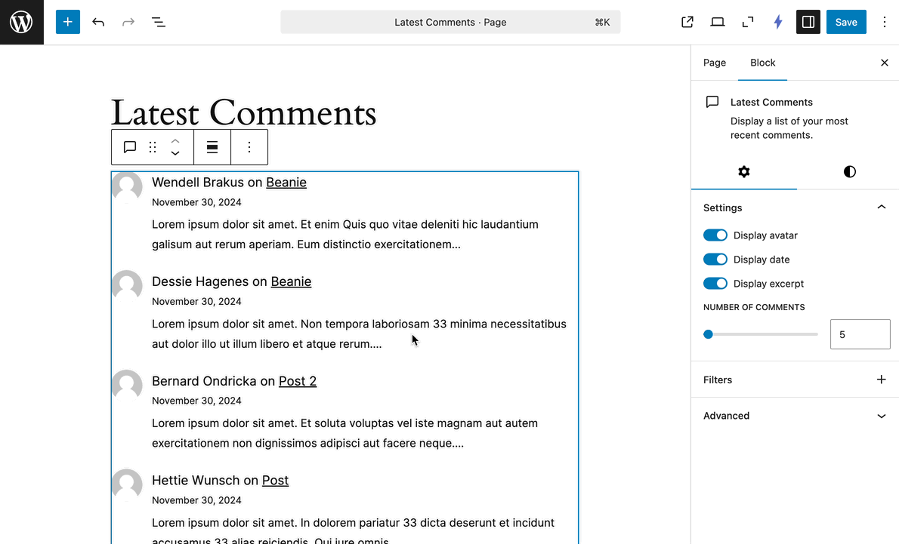

# Latest Comments Extended

> Extends the Latest Comments block with additional features.

## Description

Enhances the Latest Comments block with additional features for greater customization and functionality.



## Requirements

* PHP 7.4+
* WordPress 6.5

## Installation

### Manual Installation:

1. Download the plugin ZIP file from the GitHub repository.
2. Go to Plugins > Add New > Upload Plugin in your WordPress admin area.
3. Upload the ZIP file and click Install Now.
4. Activate the plugin.

### Install with Composer:

To include this plugin as a dependency in your Composer-managed WordPress project:

1. Add the plugin to your project using the following command:

```bash
composer require s3rgiosan/latest-comments-extended
```

2. Run `composer install` to install the plugin.
3. Activate the plugin from your WordPress admin area or using WP-CLI.

## Changelog

A complete listing of all notable changes to this project are documented in [CHANGELOG.md](https://github.com/s3rgiosan/latest-comments-extended/blob/main/CHANGELOG.md).
