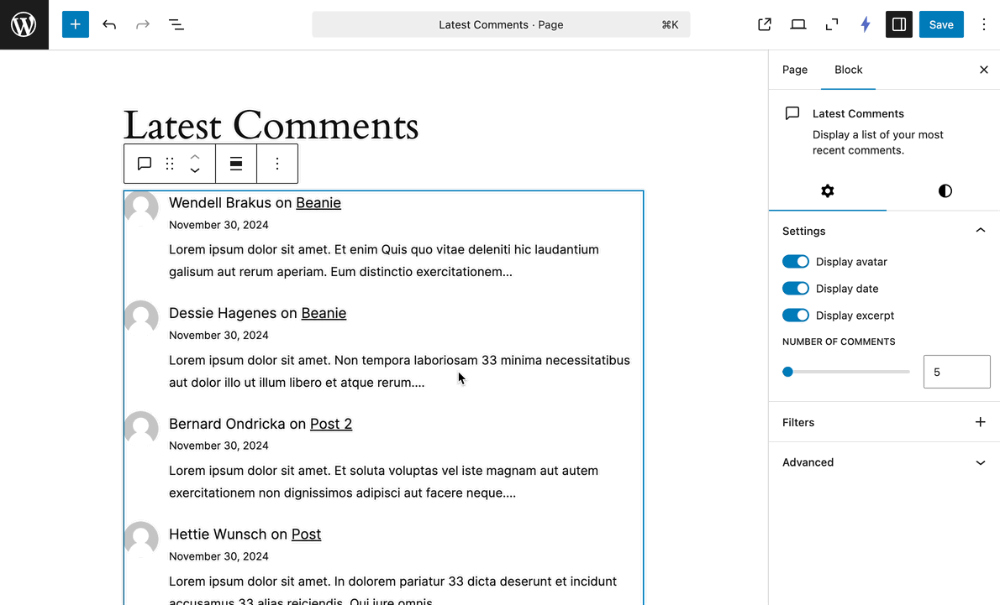

# Latest Comments Extended

> Extends the Latest Comments block with additional features.

## Description

Enhances the WordPress core Latest Comments block by adding a post type filter. By default, the Latest Comments block displays comments from all post types — this plugin lets you narrow it down to a specific one.



## Requirements

- WordPress 6.7 or later
- PHP 7.4 or later

## Features

- Filter comments by post type using a new control in the block inspector sidebar
- Automatically detects all public post types registered on your site
- Adapts the UI based on the number of available post types (dropdown for many, toggle buttons for few)
- Reset the filter to show comments from all post types

## Usage

1. Add or select a **Latest Comments** block in the editor.
2. Open the block settings sidebar.
3. Under **Filters**, choose a post type to display comments from.
4. To show comments from all post types again, choose "All" or click **Reset All**.

## Installation

### Manual Installation

1. Download the plugin ZIP file from the GitHub repository.
2. Go to Plugins > Add New > Upload Plugin in your WordPress admin area.
3. Upload the ZIP file and click Install Now.
4. Activate the plugin.

### Install with Composer

To include this plugin as a dependency in your Composer-managed WordPress project:

1. Add the plugin to your project using the following command:

```bash
composer require s3rgiosan/latest-comments-extended
```

2. Run `composer install`.
3. Activate the plugin from your WordPress admin area or using WP-CLI.

## Changelog

A complete listing of all notable changes to this project are documented in [CHANGELOG.md](https://github.com/s3rgiosan/latest-comments-extended/blob/main/CHANGELOG.md).
